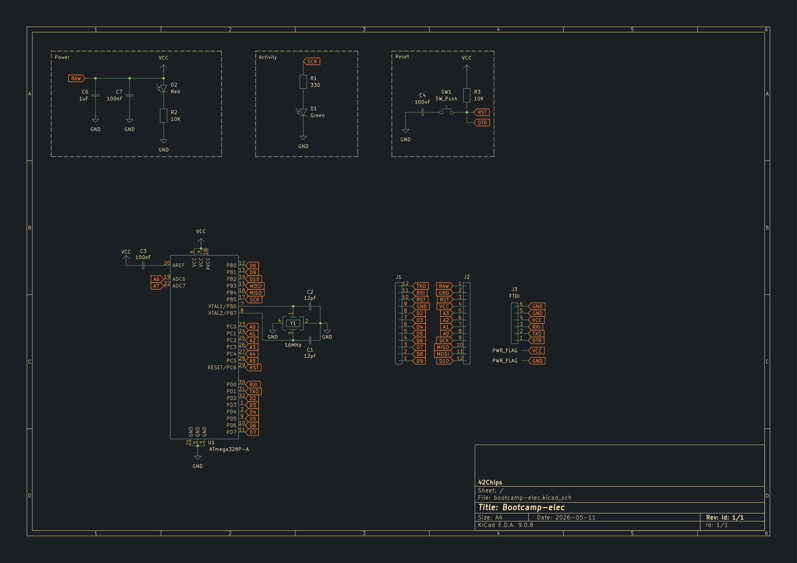
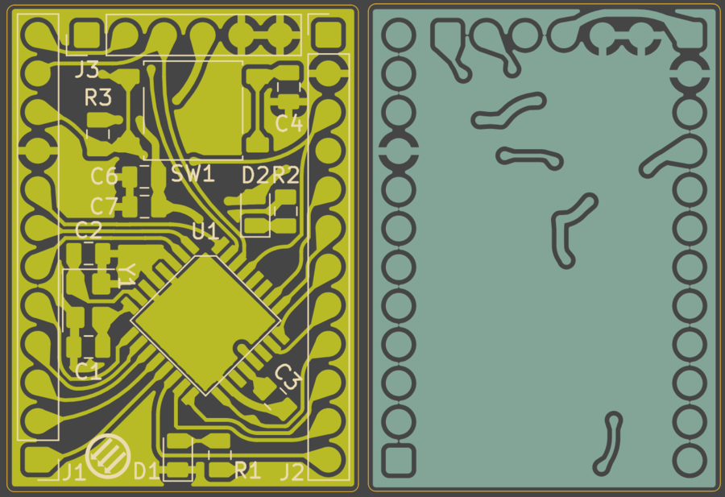
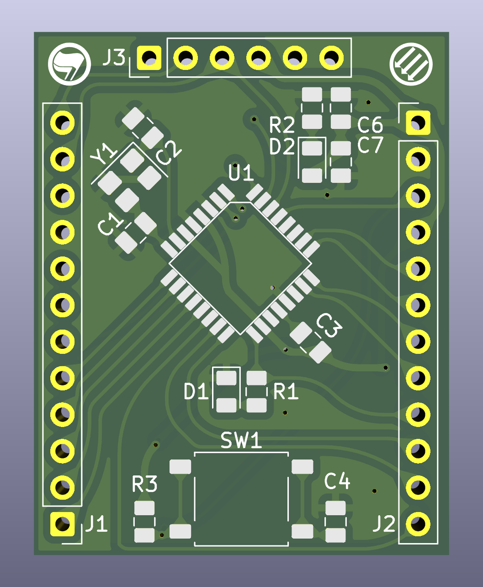
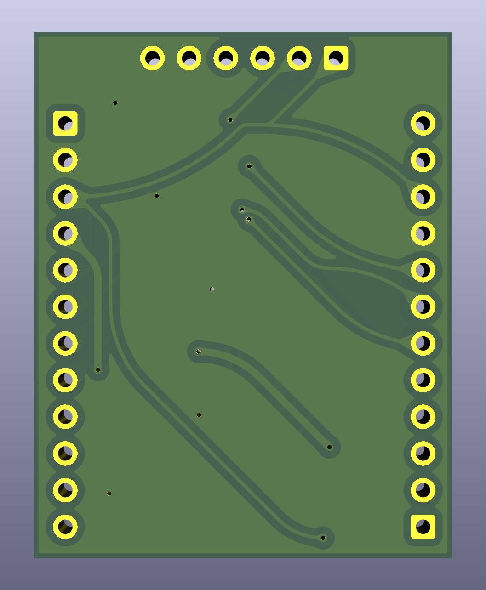

# Bootcamp Electronics - 42 Paris

_This project has been created as part of the 42 curriculum by molasz-a._

> Part of [42 Barcelona — molasz-a](https://github.com/Molasz/42), a monorepo centralizing every project completed at 42 Barcelona.

## Description

This repository contains the schematic, PCB layout and custom symbol and footprint for each component for a custom-designed microcontroller board based on the **ATmega328P**. The board was designed using KiCad 9.0.

## Bill of Materials (BOM)

| Reference | Qty | Name | Footprint | Description |
| :--- | :---: | :--- | :--- | :--- |
| **U1** | 1 | ATmega328P-AU | TQFP-32_7x7mm_P0.8mm | 8-bit AVR Microcontroller |
| **Y1** | 1 | 16.000 MHz | Crystal_SMD_3225-4Pin | SMD Quartz Crystal (3.2x2.5mm) |
| **C1, C2** | 2 | 22pF | C_0805_2012Metric | Ceramic Load Capacitors for Y1 |
| **C3, C4, C6, C7**| 4 | 100nF (0.1µF) | C_0805_2012Metric | Decoupling & DTR Capacitors |
| **R1, R2** | 2 | 1kΩ | R_0805_2012Metric | Current limiting resistors for LEDs |
| **R3** | 1 | 10kΩ | R_0805_2012Metric | Pull-up resistor for RESET line |
| **D1, D2** | 2 | LED | LED_0805_2012Metric | Status LEDs (e.g., Red/Green) |
| **SW1** | 1 | Tactile Switch | SW_Tact_6X6mm_H5mm_SMD | Reset Button |
| **J1, J2** | 2 | 1x12 Header | PinHeader_1x12_P2.54mm | Vertical Through-Hole Header (Male/Female) |
| **J3** | 1 | 1x06 Header | PinHeader_1x06_P2.54mm | FTDI Programming Header |

---

## Pinout Diagram

The board exposes its pins through three main headers. 

### J1 - Left Header (Digital & Comms)
| Pin | Label | Function |
| :---: | :--- | :--- |
| **1** | D9 | Digital Pin 9 (PWM) |
| **2** | D8 | Digital Pin 8 |
| **3** | D7 | Digital Pin 7 |
| **4** | D6 | Digital Pin 6 (PWM) |
| **5** | D5 | Digital Pin 5 (PWM) |
| **6** | D4 | Digital Pin 4 |
| **7** | D3 | Digital Pin 3 (PWM) |
| **8** | D2 | Digital Pin 2 |
| **9** | GND | Ground |
| **10** | DTR | Reset / DTR |
| **11** | RXI | Digital Pin 0 / RX |
| **12** | TXO | Digital Pin 1 / TX |

### J2 - Right Header (Analog, Power & SPI)
| Pin | Label | Function |
| :---: | :--- | :--- |
| **1** | RAW | Power Input (VCC / 5V) |
| **2** | GND | Ground |
| **3** | DTR | Reset / DTR |
| **4** | RAW | Power Input (VCC / 5V) |
| **5** | A3 | Analog Input 3 |
| **6** | A2 | Analog Input 2 |
| **7** | A1 | Analog Input 1 |
| **8** | A0 | Analog Input 0 |
| **9** | SCK | Digital Pin 13 / SPI Clock |
| **10**| MISO| Digital Pin 12 / SPI MISO |
| **11**| MOSI| Digital Pin 11 / SPI MOSI (PWM) |
| **12**| D10 | Digital Pin 10 (PWM) / SPI SS |

### J3 - FTDI / Programming Header (Top)
Standard 6-pin interface used to program the ATmega328P via a USB-to-Serial adapter.
| Pin | Label | Function |
| :---: | :--- | :--- |
| **1** | DTR | Auto-Reset (via 100nF capacitor) |
| **2** | TXO | Serial Transmit (ATmega TXD) |
| **3** | RXI | Serial Receive (ATmega RXD) |
| **4** | RAW | Power Input (VCC / 5V) |
| **5** | GND | Ground |
| **6** | GND | Ground |

---

## Schema

## PCB design

<table>
  <tr>
    <td>
      
    </td>
    <td>
      
    </td>
  </tr>
</table>

---

_molasz-a · 42 Paris_